# TheBestKpopAggregator

This project was generated with [Angular CLI](https://github.com/angular/angular-cli) version 13.1.2.

This project is for purpose of a class "Techniki Programowania Frontendowego".

The application was created for kpop fans who use social medias such as Facebook, Twitter, Instagram. These social media are necessary to be up to date with information about the idols. The application merges together these three social media.

Unfortuneatly the data are taken from mocks and just three pages were designed and created: login page, register page and user page where user can see data fetched from mock.

The authorization for this application is done using Firebase (https://firebase.google.com/) authentication (just email and password).

The login page:

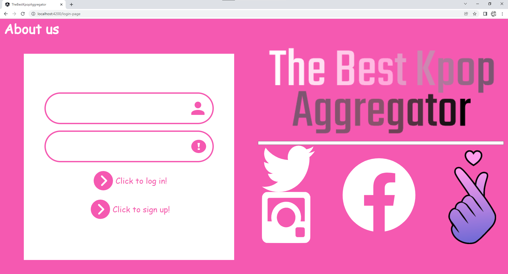

The register page:

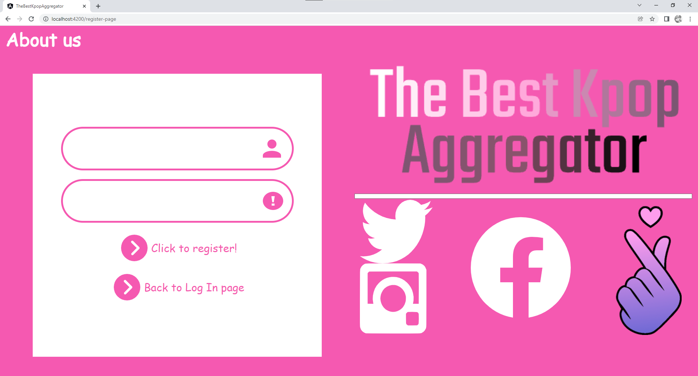

The user page:
The user is able to:
- register
- login
- view posts from three example bands from three social media (one post contains image, text, date)

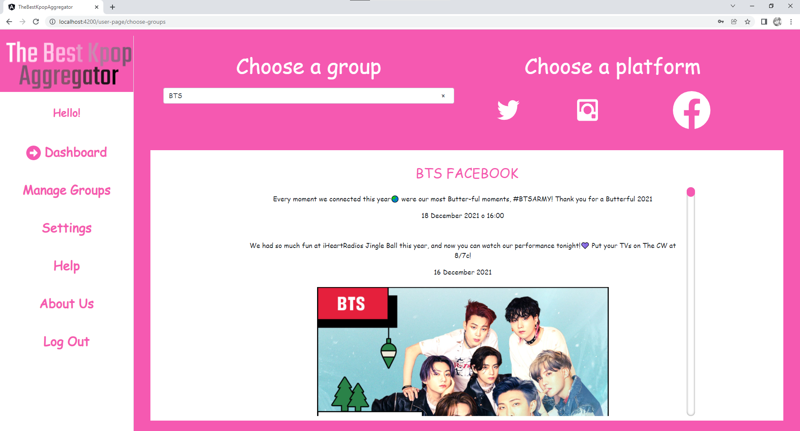

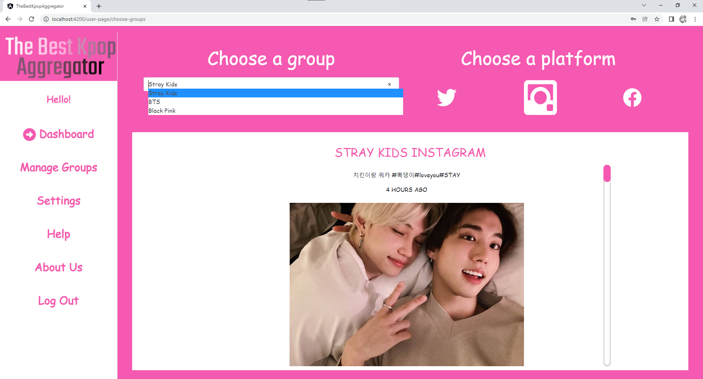

Help Page:

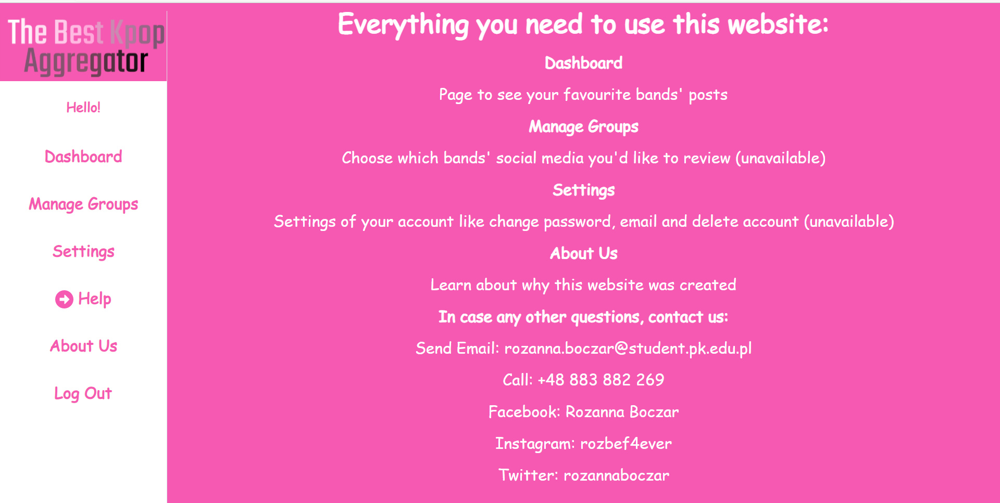

About Us Page:

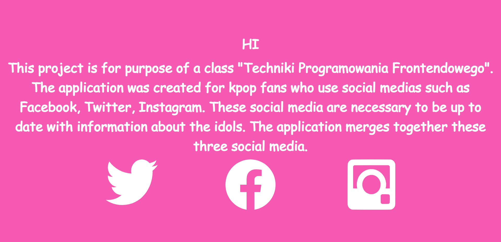

The pages that are not created:

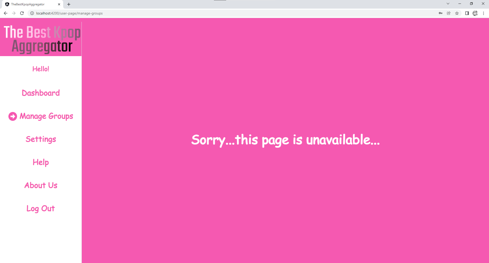

## Development server

Run `ng serve` for a dev server. Navigate to `http://localhost:4200/`. The app will automatically reload if you change any of the source files.

## Code scaffolding

Run `ng generate component component-name` to generate a new component. You can also use `ng generate directive|pipe|service|class|guard|interface|enum|module`.

## Build

Run `ng build` to build the project. The build artifacts will be stored in the `dist/` directory.

## Running unit tests

Run `ng test` to execute the unit tests via [Karma](https://karma-runner.github.io).

Most of unit tests were left default. They were changeg to provide the Firestore Authentication key.
Unit tests for login-page Component were added: for login with correct data and login with wrong data.

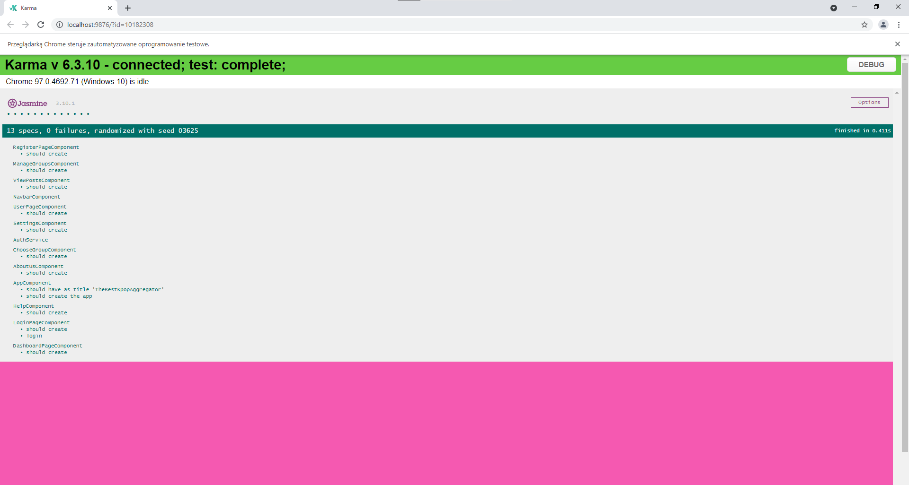

## Running end-to-end tests

Run `ng e2e` to execute the end-to-end tests via a platform of your choice. To use this command, you need to first add a package that implements end-to-end testing capabilities.

Test were written using Cypress. The tests itself are structured with the test framework Mocha. The assertions (also called expectations) are written using Chai.

There were created two group of tests: for login-page and user-page components (Of course part of other component were also used).

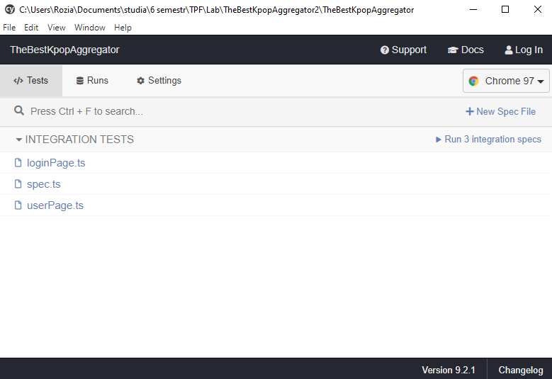

In the subfolder "cypress" can be find three files:
- "spec.ts" - the default file that Cypress creates when it's installed
- "loginPage.ts" - file for testing login-page component. The tests contains: loging in, loging out, verifying password and emial provided by the user

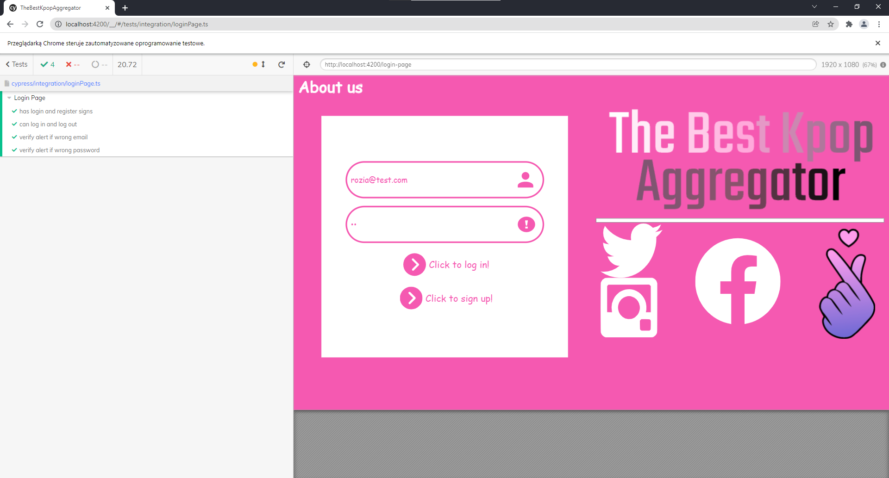

- "userPage.ts" - file for testing user-page component. The tests contains: check the default value of social media and band, changing band and social media, changing tab on navbar, loging out

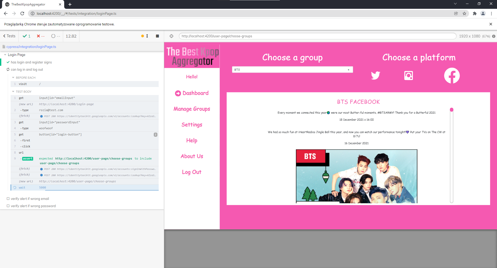
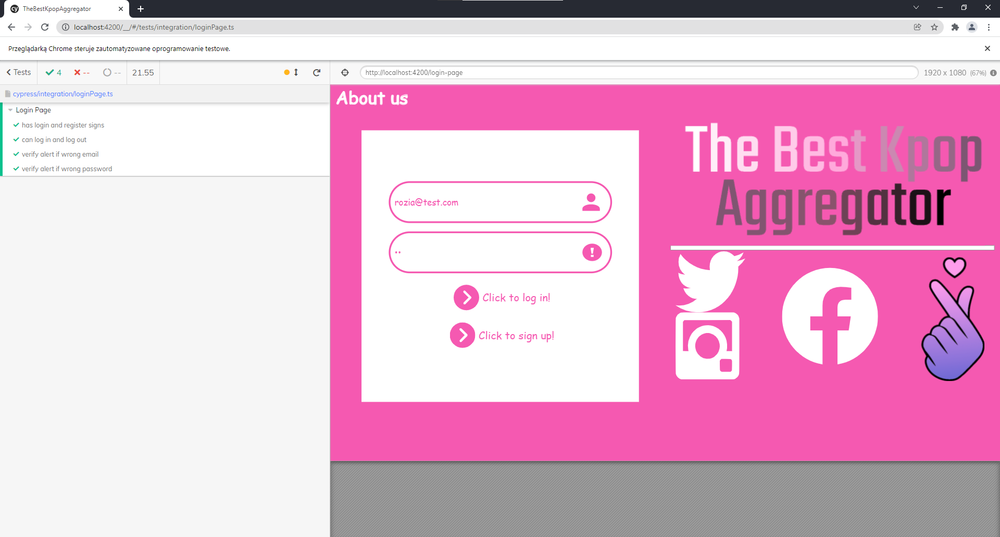

## Responsive website
IS DEAD

## Shortcuts and Animation
When user is logged int, there is a possibility to log out with pressing CTR+L.
Animation was used in choose-group Component and it's just making bigger and smaller social media signs when hover/chose it.

## Further help

To get more help on the Angular CLI use `ng help` or go check out the [Angular CLI Overview and Command Reference](https://angular.io/cli) page.
